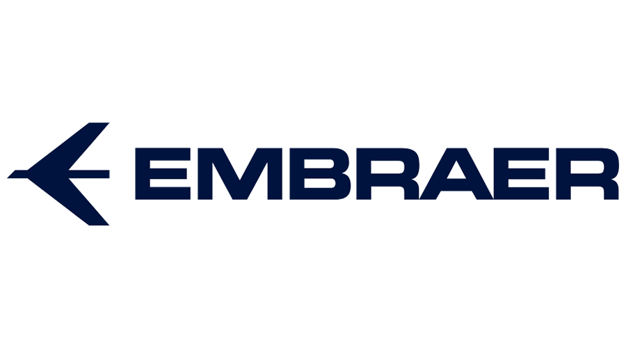

<meta charset="utf-8">
<h1 align="center">
    
</h1>

<h2 align="center">
  Embraer | Processo Seletivo
</h2>

## ✈️ Objetivo do Projeto

Temos como objetivo explorar os meios de recrutamento e valores da empresa [Embraer](https://embraer.com/br/pt/).

## 🔖 Deadline

- [x] Iniciar repositório - 06/09
- [X] 1º Deadline - 06/09
- [ ] 2º Deadline - 13/09
- [ ] Encerramento das atividades - 17/09
- [ ] 3º Deadline e finalização da primeira parte do projeto - 20/09

Participantes do Grupo
 
<strong> <strong><a href="https://github.com/ana-ccoelho">Ana Coelho</a>, <strong><a href="https://github.com/Deividev365">Deivid Almeida</a>, <a href="https://github.com/MARCOSVINICIUSDEOLIVEIRASOUZA">Marcos Vinicius</a></strong>, <strong><a href="https://github.com/VanderlanAlves">Vanderlan Almeida Alves</a>.